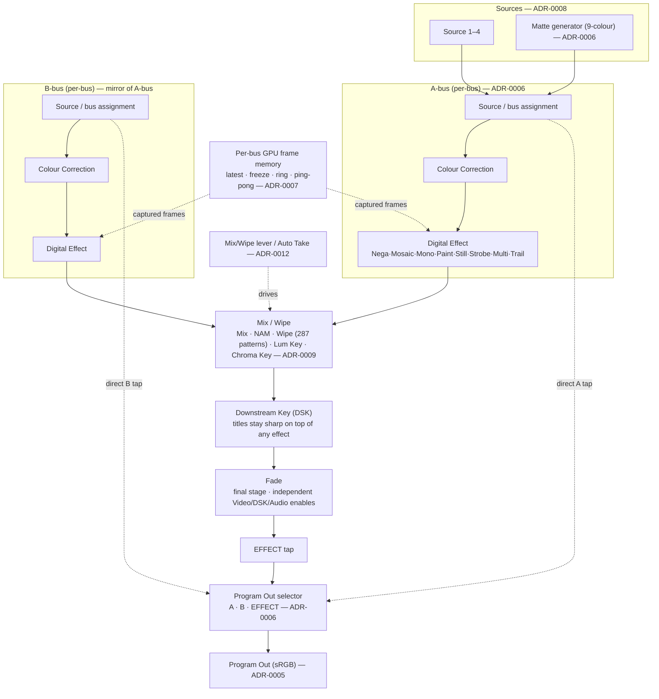
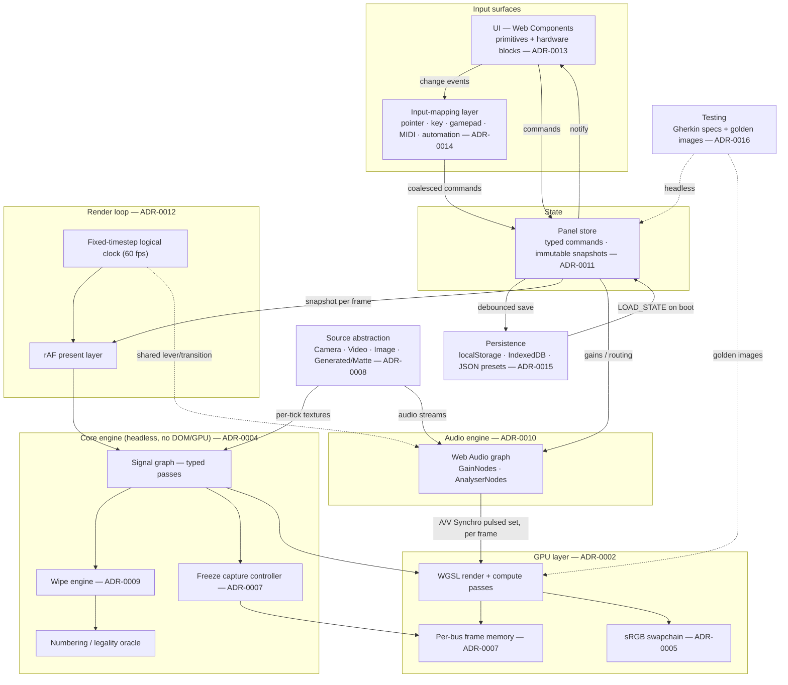

# web-mx-50 — Architecture Overview

web-mx-50 is a browser recreation of the **Panasonic WJ-MX50**, a two-bus digital
A/V mixer. It reproduces the instrument's operation — two buses, the Mix/Wipe
lever, 287 wipe patterns, the freeze-family digital effects, keys, DSK, fade, and
the audio mixer — as a clean, modern, accessible web application, rendered on
WebGPU.

This document is a map of the system: the fidelity stance, the tech stack, the
signal graph the renderer executes, and the module boundaries that separate the
render loop from the UI, the audio engine, and persistence. It summarises the
sixteen accepted ADRs in `adr/`; each claim below links to the ADR that owns it.
For the ADRs themselves, start at `adr/0001-record-architecture-decisions.md`.

---

## 1. Guiding decisions

Three owner mandates shape everything else.

**Clean-modern fidelity — ADR-0005.** The WJ-MX50 is a digital mixer wrapped
around an analog NTSC signal chain. We emulate the *behaviour the operator sees*,
not the analog substrate beneath it. The canonical video representation across the
whole pipeline is a 4-channel RGBA texture in a **linear working space**, presented
once to an **sRGB** swapchain, so keys, wipe edges, and fades composite in linear
light and look physically correct. We do **not** model 4:1:1 chroma subsampling,
interlaced fields, composite noise, or frame-synchronizer re-timing — browser
sources already arrive as discrete, progressive, full-resolution frames on the
compositor clock, so the hardware frame synchronizer is moot. Consequently the
**Frame field-versus-frame button (reference 8.10) is deferred and inert in v1**
(`features/frame-field-mode.feature`, tagged `@deferred`). A documented seam is
reserved for a future optional "analog look" post stage, appended after Program Out.

**Hybrid UI — ADR-0013.** We preserve the WJ-MX50's control grouping and metaphors
— two buses, faders, the Mix/Wipe lever, the RGB joystick, LED-style buttons — but
implement them as clean, responsive, accessible, **remappable** web controls, not a
photoreal skeuomorphic panel. The look is flat, theme-aware, keyboard-operable, with
correct ARIA; "LED blink" is a state class with a live-text equivalent, not a lamp.

**Vanilla stack — ADR-0003.** Vanilla TypeScript, banira, WebGPU, and **no UI
framework**. The UI is built from native Web Components (Custom Elements + Shadow
DOM). This keeps a reactive runtime's scheduler off the render loop's frame budget
and avoids a second, framework-owned copy of panel state. TypeScript supplies the
type-safe contracts across the store, the signal graph, the WGSL binding layer, and
the input-mapping layer.

---

## 2. Tech stack at a glance

| Concern | Choice | ADR |
| --- | --- | --- |
| Render + compute backend | **WebGPU** (WGSL); no WebGL2 fallback in v1; feature-detect and show a graceful message where absent | ADR-0002 |
| Language / toolchain | **Vanilla TypeScript + banira** (compile/dev/scaffold/manifest/lint; no bundler — import maps via esm.sh), no UI framework | ADR-0003 |
| Video data model | Linear-light **RGBA** (`rgba8unorm`, `rgba16float` reserved), **sRGB** output | ADR-0005 |
| Renderer structure | Explicit **ordered signal graph** of typed passes | ADR-0004 |
| Live-source ingest | Uniform `Source` interface; zero-copy `importExternalTexture` for camera/video | ADR-0008 |
| Freeze effects | Layered **per-bus GPU frame memory** (latest / freeze / ring / ping-pong) | ADR-0007 |
| Wipe engine | **Compositional** signed-distance mask fields + orthogonal operator stack | ADR-0009 |
| Audio | Native **Web Audio API** graph (GainNodes + AnalyserNodes) | ADR-0010 |
| State | Hand-written **single unidirectional store** with typed commands + immutable snapshots | ADR-0011 |
| Timing | rAF present loop over a **fixed-timestep logical clock** (canonical 60 fps) | ADR-0012 |
| UI | Native **Web Components**: control primitives composed into hardware-block elements | ADR-0013 |
| Input | Central **input-mapping layer** (pointer / key / gamepad / MIDI / automation) → store commands | ADR-0014 |
| Persistence | **Tiered storage**: `localStorage` scalars, IndexedDB blobs, JSON preset files | ADR-0015 |
| Testing | **Gherkin domain specs** (headless engine) + **golden-image** shader tests | ADR-0016 |

---

## 3. The signal graph

The WJ-MX50 is not a bag of independent effects; it is a **fixed-order signal
chain** (reference §1). The renderer encodes that order *structurally* as an
explicit ordered graph of typed passes, so the hardware order is the only order the
renderer can express and cannot drift with UI wiring (ADR-0004). Panel state
(ADR-0011) supplies each stage's parameters per frame; the graph *shape* never
changes at runtime, and a disabled stage passes its input through.

The two per-bus branches run the same sub-graph independently and converge at
Mix/Wipe. Everything before the merge is **per-bus** (1 texture in, 1 out);
everything after operates on the combined or downstream signal.

Why the order is load-bearing (all reference §1):

- **DSK sits downstream of the Digital Effect block on purpose.** If titles were
  keyed *before* effects, a Mosaic or Paint pass would pixelate the lettering.
  Placing DSK after Mix/Wipe keeps titles sharp over any effect (ADR-0004).
- **Fade is dead last on purpose.** It reads the fully composited, keyed signal, so
  one lever move fades the whole program — including the DSK title unless the DSK
  fade enable is left off, which is exactly the "picture disappears but the title
  remains" trick (ADR-0004, reference §11).
- **Per-bus before combining is what makes two-bus mixing meaningful.** Colour
  Correction and the Digital Effect finish per bus, so Mix/Wipe blends two fully
  conditioned pictures — including "same source, different effect on each bus"
  recipes.

**Program Out is a terminal selector, not a pass.** `A`/`B` tap each bus's
*pre-effect* assignment output directly; `EFFECT` taps the Fade output. Because a
Matte cannot be keyed, faded, or directly output, a single resolver
(`resolveBusSource(bus, context)`) substitutes the "blinking" source in the
`key`/`dsk`/`fade`/`directOut` contexts while returning the Matte itself only for
`mixWipe` — one authoritative rule instead of five drifting copies (ADR-0006).

Two graph nodes deserve their own machinery:

- **Digital Effect / frame memory (ADR-0007).** The freeze family — Still, Strobe,
  Multi, Trail — is built from a small fixed set of per-bus GPU textures: a
  *latest-frame* texture (the "frame synchronizer" survivor), a *freeze* texture, a
  16-layer *ring* history, and a *ping-pong* accumulator pair. A single per-bus
  capture controller owns interval timing (from the logical clock, ADR-0012) and the
  effect-exclusion state machine (Still excludes Strobe/Multi/Compression; Trail may
  ride on Still; A/V Synchro cannot combine with Trail), so those rules live in one
  place.
- **Mix/Wipe engine (ADR-0009).** The 287 patterns are **not** authored
  individually. Each of 7 base families is an analytic **signed-distance field**
  `f(uv, progress, variant)` evaluated in WGSL and thresholded into an A-vs-B mask;
  Compression, Slide, Multi, Pairing, and Blinds are **orthogonal coordinate/content
  operators** applied in a fixed, pinned order, with Border/Soft, direction, and
  Aspect shaping the edge. A pure numbering module mirrors the manual's Pattern Table
  (`001` plain, `n + 128` = reversed) as a mechanical **test oracle**, and a legality
  table degrades illegal combinations exactly as the hardware does (drop the modifier
  or fall back to the Straight Wipe).

---

## 4. Module boundaries

The application is layered so that the **render loop is sovereign over timing** and
the **store is sovereign over state**; the UI and the render loop are two independent
readers of the store, and neither calls into the other (ADR-0003, ADR-0011,
ADR-0012). Audio runs on its own thread, wholly decoupled from the video loop.

**Core engine / GPU passes.** The signal graph (§3) and its sub-engines (wipe,
freeze controller, numbering oracle) form a **headless, pure** engine touching only
the store and pure logic — no `document`, no `GPUDevice` in the domain layer. That
is a hard testability constraint (ADR-0016), not just a convenience: it lets Gherkin
specs drive the engine with no browser. The GPU layer below it owns the WGSL passes,
the per-bus frame memory, and the sRGB swapchain (ADR-0002, ADR-0005, ADR-0007).

**Source abstraction (ADR-0008).** One `Source` interface (`getFrameTexture`,
`intrinsicSize`, `isReady`, …) hides camera vs. video vs. image vs. generated
sources behind a uniform contract, delivering a linear-RGBA texture per tick. Camera
and video use zero-copy `importExternalTexture`; images copy once; the Matte and test
patterns are produced directly on the GPU. The graph never branches on source kind.

**Audio engine (ADR-0010).** A native Web Audio graph is a direct transcription of
the hardware Audio Mix block diagram: seven input gains, five fader gains (A, B, Aux
1, Mic/Aux2, Master), a fade-stage gain, then `destination`. It runs on the audio
thread, fully decoupled from the render loop, so audio stays glitch-free under video
load. Behaviour falls out of *topology*: the headphone monitor tap sits **upstream**
of the fade stage so monitoring never fades; Audio Follow slaves the A/B fader gains
to the same lever value the video Mix/Wipe reads (via the transition runner), so they
cannot drift; fade-to-Matte/White/Black silences while fade-to-A/B crossfades. A/V
Synchro reads an audio envelope (AnalyserNode, or an optional AudioWorklet follower)
and emits a trigger *into the store*, keeping the audio engine free of video-effect
logic.

**State store (ADR-0011).** One `PanelStore` holds one JSON-serializable
`PanelState`. Every mutation is a typed command (`ASSIGN_SOURCE`, `SET_LEVER`,
`TOGGLE_DIGITAL_EFFECT`, `RECALL_EVENT`, `LOAD_STATE`, …) through a single
`dispatch`; a pure reducer produces a new immutable snapshot via structural sharing.
This is what makes Event Memory (8 whole-panel snapshots) and Reset/field-preset thin
operations over one type, keeps concurrent input surfaces from racing, and lets the
render loop read one coherent snapshot per frame with no mid-frame tearing.
Cross-control invariants (effect exclusions, Program-Out/bus consistency) live in the
reducer so they cannot drift.

**Render loop (ADR-0012).** Two layers. The **present layer** (rAF) measures real
elapsed time, clamps it (250 ms ceiling, spiral-of-death guard), feeds an
accumulator, and renders one GPU frame — interpolating transition/fade position to
the sub-tick for smooth high-refresh motion. The **logical layer** is a
fixed-timestep clock ticking at a **canonical 60 fps**, where one tick = one WJ-MX50
video frame. All effect timers, transitions, and Special Modes read only the logical
clock, so a Strobe interval or a 300-frame Auto Fade behaves identically on any
display and is deterministic for tests. Seconds and frames both reduce to ticks
through the single constant `NTSC_FRAME_HZ = 60`; Auto Take and Auto Fade share one
transition runner whose pause/resume is drift-free by subtracting paused ticks.

**UI — Web Components (ADR-0013).** A small set of reusable **control primitives**
(`mx-led-button`, `mx-fader`, `mx-lever`, `mx-joystick`, `mx-knob`, `mx-readout`),
each with a defined ARIA contract and full keyboard support, are composed by **block
components** that mirror the reference's hardware sections (`mx-source-block`,
`mx-mixwipe-block`, `mx-digital-effect-block`, `mx-memory-block`, …) inside an
`mx-panel` CSS-grid host that reflows from a wide desktop panel to a single narrow
column. Primitives are stateless with respect to domain meaning: blocks read a store
slice and translate primitive events into commands. Deferred hardware (the Frame
button) is shown `aria-disabled` with an explanation rather than omitted.

**Input-mapping layer (ADR-0014).** One layer normalises every surface —
pointer/touch, keyboard chords, the Gamepad API (polled per tick), Web MIDI (notes →
discrete, CC → continuous, optional LED/motor feedback out), and a local automation
API — into signals addressed to *logical control ids*, resolved through a
**remappable binding table** (persisted) into the store's command vocabulary. So the
on-screen lever, a MIDI fader, and an arrow key are three views of one action. The
hardware editing interfaces of reference §17 survive in intent, not wiring: GPI
becomes a mappable `autoTake.trigger` (optionally a real foot-switch via Web Serial);
RS422/RS232C become the local automation/scripting API; the genlock timing outputs
are moot under the clean-modern decision.

**Persistence (ADR-0015).** A single module owns all storage. Tiered by size:
`localStorage` for small hot scalars (settings, the Reset policy flag, the field
preset, the 8 Event Memory slot snapshots minus heavy pixels); **IndexedDB** for
captured-still blobs (Scene Grabber / PiP freezes), loaded lazily; **JSON files** for
versioned, shareable preset import/export the hardware never offered. What is
persisted is a projection of the ADR-0011 store, so saved and live state cannot
diverge. Two hardware power-up policies are modelled explicitly: **Reset ON** boots
the factory preset; **Reset OFF** (field preset) rehydrates the last snapshot with a
`FIELD_PRESET_OMIT` filter that strips Still/Strobe/Special (reference §18). Runtime
GPU frame memory (ADR-0007) is deliberately never serialised; schema versioning plus
a factory-preset fallback keeps the boot path crash-proof.

**Testing (ADR-0016).** Two failure modes, two oracles. **Domain logic** (Matte
substitution, wipe numbering/legality, fade-audio rules, transition timing) is pure
and is executed *directly from the `./features/*.feature` living specification* via
cucumber-js against the headless engine — the specs are the tests, no duplication,
and they run anywhere with no GPU. **Shader output** (key edges, wipe boundaries,
mosaic grids, matte colours) is verified by **golden-image / SSIM** tests rendering
isolated passes through a headless (Dawn-based) WebGPU runner with fixed inputs and an
injectable clock. Tags gate execution: `@deferred` (e.g. `frame-field-mode.feature`)
is registered but not run, `@integration` recipes run in a slower suite, `@wip` is
excluded. CI requires the fast Gherkin+unit gate on every push; the GPU layer runs
where an adapter exists and is reported *skipped, not failed*, otherwise.

---

## 5. Cross-cutting threads

A few decisions recur across modules and are worth reading as a set:

- **One clock, two consumers.** The fixed-timestep logical clock (ADR-0012) drives
  the freeze capture controller's intervals (ADR-0007) and the shared Auto Take /
  Auto Fade transition runner; Audio Follow and Auto Fade read the same transition
  position (ADR-0010), so audio and video crossfades stay locked.
- **One command vocabulary.** The store's typed commands (ADR-0011) are the single
  contract that the UI (ADR-0013), the input-mapping layer (ADR-0014), Event Memory
  recall, and persistence boot (ADR-0015) all target. Nothing writes state except via
  `dispatch`.
- **One fidelity contract.** Linear-RGBA in, sRGB out (ADR-0005) is assumed by every
  source (ADR-0008), every graph pass (ADR-0004), the frame memory (ADR-0007), and
  the golden-image colour-ramp assertions (ADR-0016). The deferred analog look and
  the inert Frame button are the same decision seen from different modules.
- **Deferred, not denied.** Where the hardware's analog nature has no browser
  meaning — the Frame button, the frame synchronizer, composite/S-Video input
  priority, genlock timing outputs — the behaviour is captured as a documented,
  disabled, or moot seam rather than silently dropped, so the model stays honest to
  the reference.

---

## 6. Where to go next

- **The reference** (authoritative hardware behaviour):
  `docs/wj-mx50-feature-reference.md`.
- **The decisions** in full: `adr/0001-…` through `adr/0016-…`.
- **The living specification** (behaviour as executable Gherkin): `features/`.
